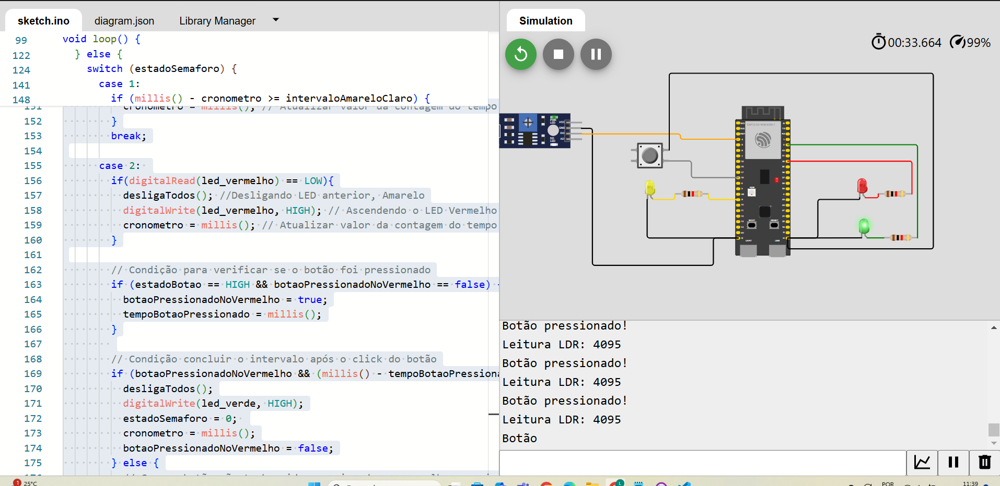
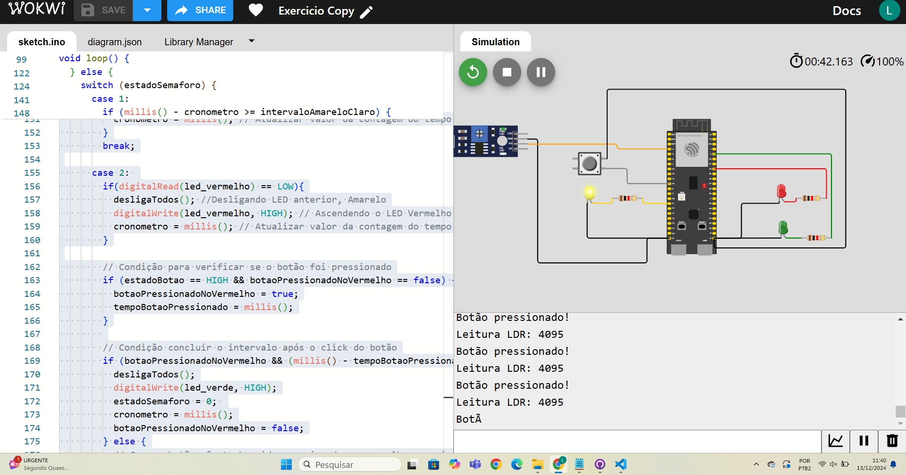
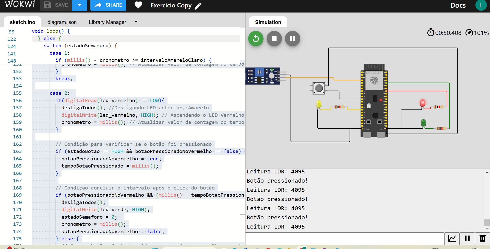

O protótipo tem dois estados:
1. Modo escuro: led amarelo pisca a cada 1 segundo
2: Modo Claro: funcionamento normal com a sequencia do led verde, amarelo e vermelho. Implementei a condição do botão na qual troca o estado do semáforo do vermelho para o verde em 1 segundo
PS: Precisa precionar bem o botão para acontecer a condição, ou precionar mais de uma vez.

